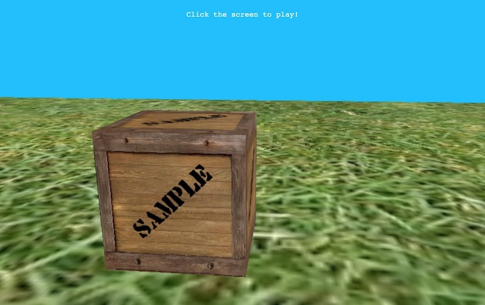

# First Person Elm

[][live demo]

This is a demo of using the [Elm][elm] language [package][elm-explorations/webgl] for [WebGL][webgl], combined with [Elm ports] and the browser [Fullscreen] and [Pointer Lock] APIs, to create a first person navigation experience in the browser.

## Demo

Check out the [live demo]! It has been tested on Chrome, Edge, and Firefox.

## Attribution

This was inspired by an [original demo] by [evancz]. That project uses an old version of Elm, so it was brought up to date for Elm 0.19 with the Elm WebGL package's existing first person [example].

Since the package example is an illustration of the package's capabilities alone, it doesn't include pointer movement or fullscreen support.

The crate texture came from the [elm-explorations/webgl] example, and the ground texture came from [Open Game Art].

## Development

This project was bootstrapped with [Create Elm App]. You can install it with:

```sh
npm install -g create-elm-app
```

Then you can run the development server with:

```sh
elm-app start
```

View the app by visiting http://localhost:3000 in your browser.

## License

Copyright © 2019 Jeff Cole. See [LICENSE](LICENSE) for more information.

[elm]: https://elm-lang.org
[webgl]: https://developer.mozilla.org/en-US/docs/Web/API/WebGL_API
[elm-explorations/webgl]: https://github.com/elm-explorations/webgl
[elm ports]: https://guide.elm-lang.org/interop
[fullscreen]: https://developer.mozilla.org/en-US/docs/Web/API/Fullscreen_API
[pointer lock]: https://developer.mozilla.org/en-US/docs/Web/API/Pointer_Lock_API
[live demo]: http://jeff-cole.com/first-person-elm
[original demo]: https://github.com/evancz/first-person-elm
[evancz]: https://github.com/evancz
[example]: https://github.com/elm-explorations/webgl/blob/master/examples/first-person.elm
[open game art]: https://opengameart.org/content/wall-grass-rock-stone-wood-and-dirt-480
[create elm app]: https://github.com/halfzebra/create-elm-app
